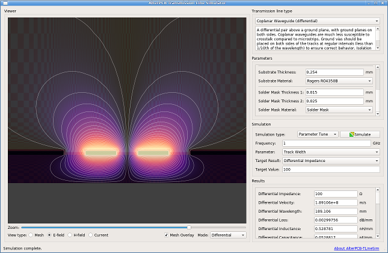

AlterPCB Transmission Line Simulator
====================================

This program is a part of AlterPCB, an open-source, cross-platform PCB design program. AlterPCB is still a work in progress, but since this tool is quite useful by itself, I decided to release it as a stand-alone program.

Features
--------

- Calculates transmission line properties such as characteristic impedance, propagation velocity, wavelength, loss, capacitance, inductance, ...
- Uses an accurate quasi-TEM field solver rather than approximate formulas. As a result it can simulate arbitrary cross sections.
- Includes models for uncommon transmission line types such as differential coplanar waveguides.
- Models optionally include solder mask (which can have a small impact on characteristic impedance and loss).
- Simulates both resistive and dielectric losses (including skin effect and proximity effect).
- Supports anisotropic materials (most PCB substrates such as FR4 are in fact anisotropic).
- Supports single frequency analysis as well as frequency and parameter sweeps.
- Supports automatic parameter tuning (e.g. to determine the track width that will result in an impedance of 50 ohm).
- Straightforward graphical user interface (Qt-based).
- Open-source and cross-platform.

License
-------

GNU GPL v3 - read 'COPYING' for more info.

Dependencies
------------

- Compiler with C++11 support (GCC >= 5.0 or Clang >= 3.3)
- Qt 4 or 5
- SuiteSparse (specifically CHOLMOD)
- BLAS and LAPACK (OpenBLAS performs best, ATLAS is reasonable, reference (netlib) BLAS is quite slow)

CHOLMOD appears to interact badly with multithreaded BLAS/LAPACK implementations, especially those without OpenMP support. If you are using OpenBLAS, you will get the best performance when OpenBLAS is compiled without any threading support (USE_OPENMP=0 USE_THREAD=0). If you can't recompile OpenBLAS, the next best option is to disable threads at runtime using the OMP_NUM_THREADS environment variable:

	OMP_NUM_THREADS=1 ./alterpcb-tlinesim

Compiling and installing
------------------------

Compiling should be done with Qt Creator or 'qmake' as usual. Right now installation is not supported yet.
